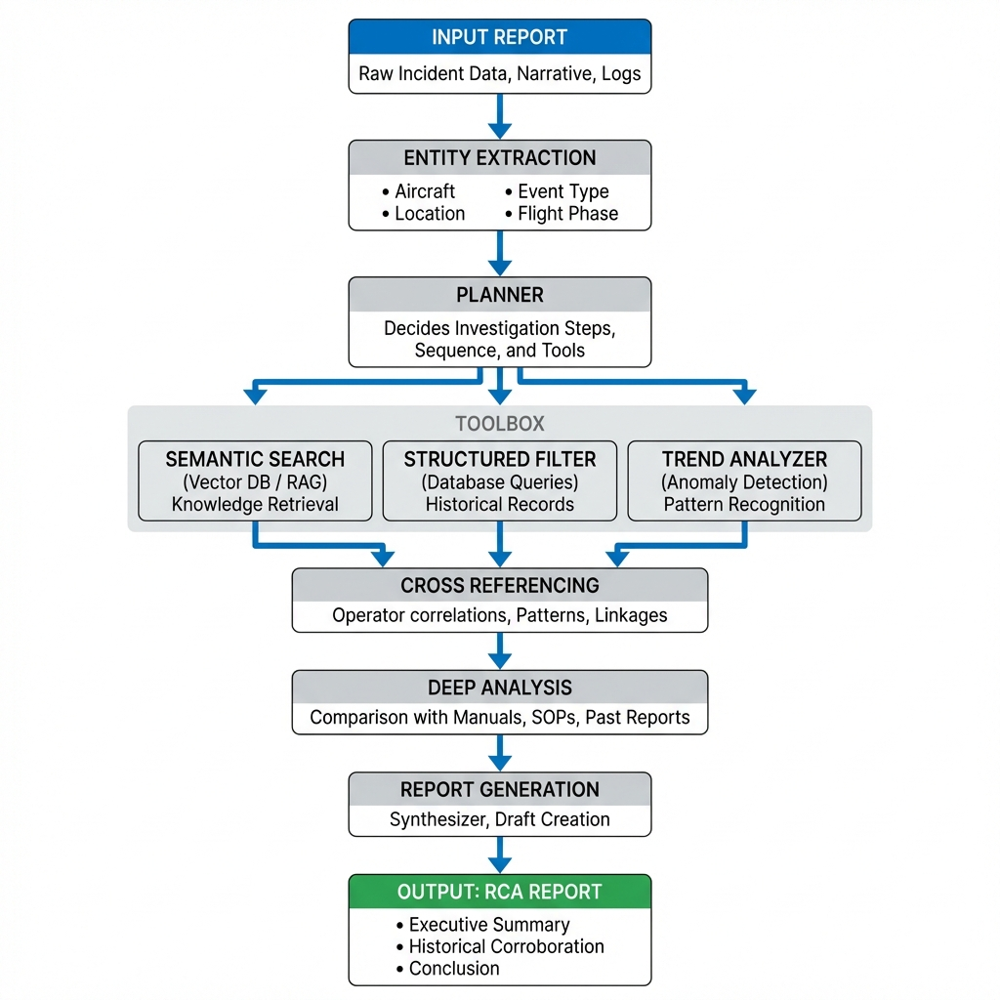

# Aviation Safety Agent (ASI Agent) ✈️

An intelligent autonomous agent designed to investigate aviation safety reports (NASA ASRS). Built with **LangGraph** and **LLMod.ai**, it performs deep root cause analysis using a ReAct-based architecture.



## 🌟 Features

*   **Autonomous Investigation**: A dynamic ReAct loop (Decide → Act → Observe) ensures thorough investigation.
*   **True Reasoning**: The agent dynamically selects tools and reasons about findings at every step.
*   **Semantic Search**: Retrieves similar historical incidents using **Pinecone** / **ChromaDB**.
*   **Trend Analysis**: Detects anomaly patterns in incident frequency over time.
*   **Execution Tracing**: Full visibility into the agent's "thought process" (steps, prompts, responses).
*   **Premium UI**: Dark glassmorphism interface with architecture diagrams and real-time streaming.
*   **Cloud Logging**: All executions are logged to **Supabase** for audit and playback.

## 🛠️ Tech Stack

*   **Core**: Python 3.11, [LangChain](https://langchain.com), [LangGraph](https://langchain-ai.github.io/langgraph/)
*   **API**: [FastAPI](https://fastapi.tiangolo.com)
*   **Frontend**: HTML5, Vanilla JS, CSS3 (Glassmorphism)
*   **LLM Provider**: [LLMod.ai](https://llmod.ai) (`gpt-5-mini` & `text-embedding-3-small`)
*   **Databases**:
    *   **Supabase**: Primary database (Execution Logs)
    *   **Pinecone**: Production Vector Store
    *   **ChromaDB**: Local Development Vector Store

## 🚀 Quick Start (Local)

1.  **Clone the repository**:
    ```bash
    git clone https://github.com/kobkob1234/AI-Agents-for-Business-Applications.git
    cd AI-Agents-for-Business-Applications
    ```

2.  **Install Dependencies**:
    ```bash
    pip install -r requirements.txt
    ```

3.  **Configure Environment**:
    Create a `.env` file (or use system env vars):
    ```env
    OPENAI_API_KEY=your_llmod_api_key  # LLMod.ai Key
    OPENAI_BASE_URL=https://api.llmod.ai/v1
    SUPABASE_URL=https://lwnzbsulpbesggkhttnv.supabase.co
    SUPABASE_KEY=your_supabase_anon_key
    PINECONE_API_KEY=your_pinecone_key
    ```

4.  **Run the Server**:
    ```bash
    uvicorn src.server:app --host 0.0.0.0 --port 8000 --reload
    ```
    Open [http://localhost:8000](http://localhost:8000) in your browser.

## 🌐 Live Demo

**Render URL**: [https://asi-agent-s5nr.onrender.com](https://asi-agent-s5nr.onrender.com)

## ☁️ Deployment (Render)

This project is configured for **Render**.

*   **Build Command**: `pip install -r requirements.txt`
*   **Start Command**: `uvicorn src.server:app --host 0.0.0.0 --port $PORT`
*   **Python Version**: `3.11.0` (set via `PYTHON_VERSION` env var)

## 📡 API Endpoints

| Method | Endpoint | Description |
| :--- | :--- | :--- |
| `GET` | `/api/team_info` | Returns team name & student details. |
| `GET` | `/api/agent_info` | Returns prompt templates & examples. |
| `GET` | `/api/model_architecture` | Returns the architecture diagram image. |
| `POST` | `/api/execute` | Runs the agent. accepts `{"prompt": "..."}`. |


**Developed for AI Agents for Business Applications Course (Winter 2026)**
